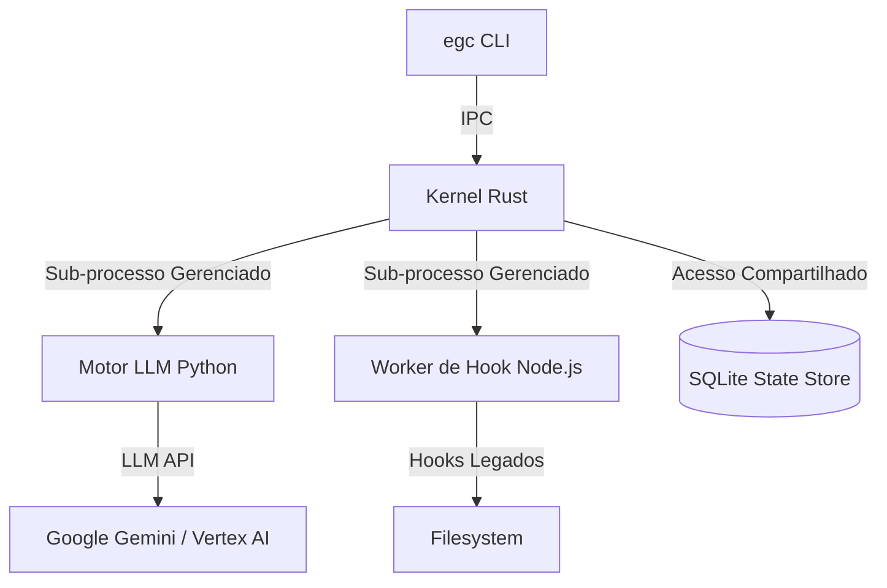

# DESIGN TECNICO EGC 2.0: A FUNDACAO DO AGENTE OS

**Arquiteto:** Unidade Arquitetural EGC
**Status:** Especificacao Tecnica
**Versao:** 1.0.0 (Proposta de Design)

---

## 1. MAPA DE INTEGRACAO DE COMPONENTES

A arquitetura EGC 2.0 centraliza a orquestracao em um **Kernel Persistente Baseado em Rust**.



---

## 2. PLANO DE CONTROLE UNIFICADO (O KERNEL)

### 2.1 Orquestracao Persistente
- O Kernel inicia como um daemon em background (`egcd`).
- Ele mantem um pool de workers:
    - **Pool LLM:** Processos Python para inferencia e logica.
    - **Pool de Hooks:** Processos Node.js para execucao de governanca.

### 2.2 Protocolo IPC (gRPC/Protobuf)
Substitui o frágil piping JSON via STDIN/STDOUT.

**Definicao de Servico:**
```protobuf
service AgentOS {
  rpc ExecutePrompt(PromptRequest) returns (PromptResponse);
  rpc InterceptTool(ToolCall) returns (InterceptionResult);
  rpc LogEvent(Event) returns (Ack);
}
```

---

## 3. FABRIC DE MEMORIA DETERMINISTICA

### 3.1 Schema de Armazenamento Unificado (SQLite)
O Kernel gerencia um unico banco de dados SQLite em `~/.gemini/egc/egc.db`.

**Tabelas Principais:**
- `sessions`: `id (PK), project_id, metadata, start_time, end_time`
- `events`: `id, session_id, event_type, payload (JSON), timestamp`
- `instincts`: `id, project_id, trigger, content (Markdown), confidence`

### 3.2 Migracao de Namespace
- **Alvo:** `~/.gemini/egc/`
- **Ponte:** Durante a transicao, se `~/.gemini/egc/` estiver ausente, o Kernel tentara criar symlink ou migrar dados de `~/.gemini/homunculus/`.

---

## 4. GOVERNANCA DE ALTA FIDELIDADE (BLOQUEIO DE ESTADO)

### 4.1 O Loop Interceptor
O Kernel implementa um gate de governanca sincrono e bloqueante para cada chamada de ferramenta.

1. **`TOOL_REQUEST`**: Motor Python solicita execucao de ferramenta.
2. **`PRE_FLIGHT_CHECK`**: Kernel despacha hooks de bloqueio para workers Node.js.
3. **`VETO_OR_MUTATE`**: Se um hook falhar ou mutar, o Kernel responde ao Python imediatamente (bloqueando a execucao).
4. **`EXECUTION`**: Se as verificacoes passarem, o Kernel executa a ferramenta.
5. **`POST_FLIGHT_AUDIT`**: Kernel captura o resultado, despacha hooks cientes do resultado, depois retorna o resultado final ao Python.

### 4.2 Integridade Causal
Ao mover o loop para o Kernel, garantimos que `PostToolUse` sempre tem acesso ao valor de retorno da ferramenta *antes* que o modelo continue seu raciocinio.

---

## 5. SOBERANIA E COMPATIBILIDADE

### 5.1 Compatibilidade de Artefatos
- **Agentes:** O EGC 2.0 le os mesmos arquivos `agents/*.md`.
- **Skills:** A documentacao de skills permanece autoritativa. O Kernel os injeta no contexto do motor Python.

### 5.2 Soberania Ambiental
- Elimina referencias hardcoded a `ECC_*` na logica principal.
- Padroniza em `EGC_PROJECT_ROOT` e `EGC_SESSION_ID`.

---
**Veredicto do Arquiteto:** Este design resolve a "Fragmentacao de Processos" do v1 introduzindo um sistema circulatorio compartilhado para estado e controle, estabelecendo o EGC como um verdadeiro Agente OS soberano.
